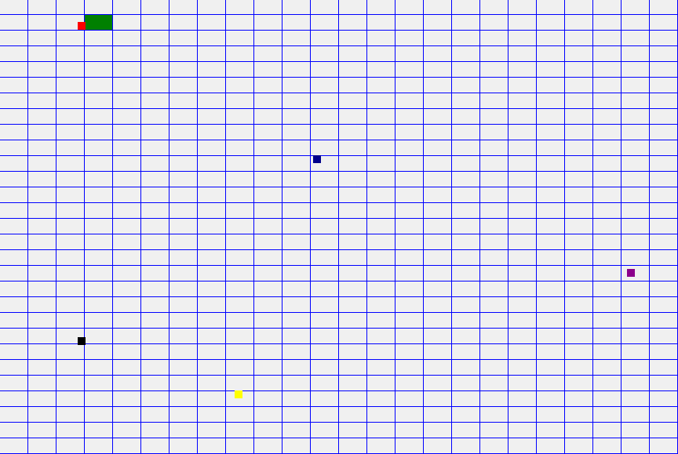

# Pathfinder on Windows Forms - A* Algorithm

Basic implementation of the A* algorithm in Windows Forms and GDI+. 

Modified from the code by [Sebastian Lague](https://github.com/SebLague), available [here](https://github.com/SebLague/Pathfinding). He also made a video series with the explanation, available on [YouTube](https://www.youtube.com/playlist?list=PLFt_AvWsXl0cq5Umv3pMC9SPnKjfp9eGW).

All the credits for the implementation go to him.

## License

This project is available under the GNU General Public License v3.0. See more on [LICENSE](LICENSE).
